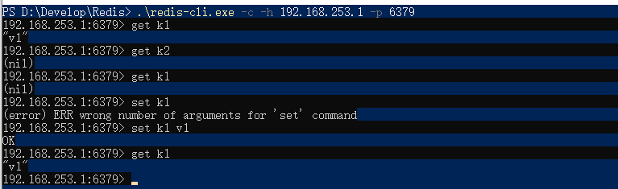

# Redis使用

## Redis安装运行 ##

```text
1. $ wget http://download.redis.io/releases/redis-5.0.8.tar.gz
2. $ tar xzf redis-5.0.8.tar.gz
3. $ cd redis-5.0.8
4. $ make(这个步骤的前提是需要安装编译工具)
    1. $ apt-get install build-essential(安装编译工具)
    
5. $ src/redis-server ../redis.conf
6. src/redis-cli    
```



## Redis的