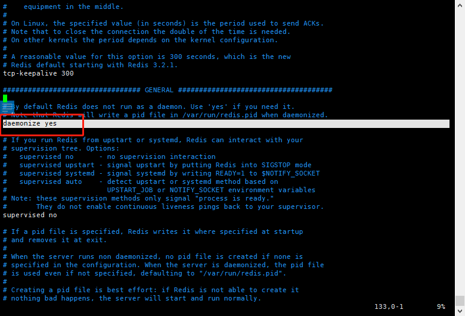

# Redis使用

## Redis安装运行 ##

```text
1. $ wget http://download.redis.io/releases/redis-5.0.8.tar.gz
2. $ tar xzf redis-5.0.8.tar.gz
3. $ cd redis-5.0.8
4. $ make(这个步骤的前提是需要安装编译工具)
    1. $ apt-get install build-essential(安装编译工具)
    
5. $ src/redis-server 
6. src/redis-cli    
```


## Redis的停止和启动 ##

在上面的步骤安装好redis之后我们就可以启动redis了，但是redis的启动使用的是默认的
配置,这样就无法进行定制，为此我们启动的时候可以指定我们自己的配置文件，让redis-server
使用我们的配置。

```text
1. src/redis-server ../redis.conf
```

如果redis-server使用从软件仓库中安装的，那么就可以使用以下的方式启动

```text
1. /etc/init.d/redis-server start
```

如果redis-server守护进程的方式在后台启动，那么可以编辑配置文件如下：

```text
1. daemonize yes
```



关闭redis-server可以使用Ctrl+C(redisz是一前台的模式启动的)，或者Kill+PID(redis是一后台的模式启动)的方式停止服务
```text
kill 'pidof redis-server'
```
但是推荐更加优雅的方式关闭的是使用redis-cli调用shutdown命令
```text
1. $src/redis-cli shutdown 

2. 如果从软件仓库安装的话，还可以使用init.d的脚本关闭
$/etc/init.d/redis-server stop
```

## redis的工作原理 ##

### Redis-server 服务端 ###
redis-server代表一个redis实例.在一台宿主机器上可以同时运行多个redis实例，但是这些实例需要使用不太的配置才可以。
对于redis而言启动没有什么需要注意的,但是优雅的停止redis服务确实保证服务端数据一致性的是很重要的，所以推荐使用shutdown的
方式来停止服务，保证服务的能够将数据一致性


### Redis-cli 客户端 ###

```text

1. redis-cli默认会连接到127.0.0.2:6379(默认端口)上运行的实例，我们可以使用-h指定主机和-p
指定端口。
2. 除此之外，如果redis实例启用了unix套接字文件，那么-s选项来指定Unix套接字文件既可以连接搭配Redis服务器


```
### Info 返回的相关信息 

| 段落名称 | 描述 |
|------|------------|
|server|关于Redis服务器的基本信息|
|Clients|客户端连接的状态和指标|
|Memory|大致的内存消耗指标|
|Persistence|持久化相关的状态和指标|
|Stats|总体统计信息|
|Replication|主从复制的相关的状态和指标|
|CPU|CPU使用的情况|
|Cluster|Redis Cluster的状态|
|keyspace|数据库相关的统计数据|

;


## Redis事件模型
Redis是以其高性能而著称，最大程度的利用单线程，非阻塞的I/O模型来快速的处理请求。


