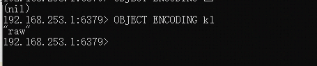

# Redis的数据类型
* string
* list
* hash
* set
* sorted set 
* HyperLongLong
* Geo

## Redis使用string数据类型 ##

```text

1. SET命令设置一个键值
2. GET 键可以轻松返回值
3. STRLEN 键可以返回值的字符疮毒

```


如果使用SET命令执行成功那么返回OK。APPEND命令将会将字符串追加导现有的字符串的末尾，
并且返回新的字符串的长度。如果追加的键不存在，那么redis将先创建一个空的字符串并且于
键相关联，然后APPEND命令。STRANGE命令会覆盖字符串的一部分(从指定的偏移量开始导字符串的末尾)


需要注意的地方：
```text
1.如果某个键已经存在了，那么set命令会覆盖该键此前的对于的值。有时我们不希望再键存在的时候盲目的进行覆盖;这个时候就需要我们想
判断我们需要操作的键是否已经存在，redis为我们提供了了SETNX命令，用于原子性的，仅在键不存在的键的值。如果将的值设置成功,
那么SETNX返回1，如果键已经存在，那么返回0且不覆盖.

2. 我们可以使用MSET和MGET命令来一次性的设置和获取多个键的值。使用MSET的有点的是真个操作时原子性的。意味着所有的键都是在客户机
制和服务器之间的一次性通信中设置的。MSET不是发出多个SET命令来假声网络开销

```

#### redis 编码 ####

redis使用了三种不太的编码方式来存储字符串对象，并且会根据每个字符串自带觉得所以使用的编码方式

* int:用于能够使用64为符号整数表示的字符串
* embstr: 用于长度小于或者等于44字节(redis中时39字节)的字符串；这类性的编码在内存使用和性能方面更加有效率。
* raw:用于长度大于44字节的字符串。


查看键相关的联的Redis值对象的内部编码方式：




OBJECT指令的其他使用方式：

```text

* OBJECT idletime key :key对应的值空余的时间
* OBJECT refcount key :key对应的值有多少个引用


```

## Redis使用list数据类型 ##

链表能够存储一组对象，一次可以使用它作为栈或者队列。在Redis中，于键相关联的值可以时字符串组成的列表。
Redis中的列表更像时数据结构中双向列表。


* LPUSH 对列名称 value... 插值入队列(表示从队列的左边插入值)
* LRANGE 队列名称 开始角标 结束偏移量(如果是-1表示返回所有)
* RPUSH 队列的名称 value .. 从队列的右边插入值
* LINSERT 队列名称 after/before v1 v2 在v1的前面或者后面添加v2
* LINDEX 队列名称 索引位置
* LPOP/RPOP从队列中删除一个元素
* LTRIM 队列 start end 在队列的起始位置和结束位置的范围内删除元素
* LSET 队列名称 角标 值

提示：如果想在队列村子啊的是时候才插入元素，那么可以使用LPUSHX和RPUSHX


