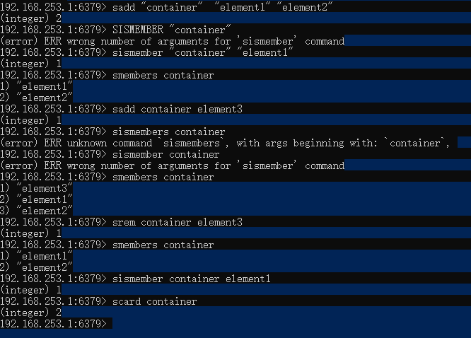

# Redis的数据类型
* string
* list
* hash
* set
* sorted set 
* HyperLongLong
* Geo

## Redis使用string数据类型 ##

```text

1. SET命令设置一个键值
2. GET 键可以轻松返回值
3. STRLEN 键可以返回值的字符疮毒

```


如果使用SET命令执行成功那么返回OK。APPEND命令将会将字符串追加导现有的字符串的末尾，
并且返回新的字符串的长度。如果追加的键不存在，那么redis将先创建一个空的字符串并且于
键相关联，然后APPEND命令。STRANGE命令会覆盖字符串的一部分(从指定的偏移量开始导字符串的末尾)


需要注意的地方：
```text
1.如果某个键已经存在了，那么set命令会覆盖该键此前的对于的值。有时我们不希望再键存在的时候盲目的进行覆盖;这个时候就需要我们想
判断我们需要操作的键是否已经存在，redis为我们提供了了SETNX命令，用于原子性的，仅在键不存在的键的值。如果将的值设置成功,
那么SETNX返回1，如果键已经存在，那么返回0且不覆盖.

2. 我们可以使用MSET和MGET命令来一次性的设置和获取多个键的值。使用MSET的有点的是真个操作时原子性的。意味着所有的键都是在客户机
制和服务器之间的一次性通信中设置的。MSET不是发出多个SET命令来假声网络开销

```

#### redis 编码 ####

redis使用了三种不太的编码方式来存储字符串对象，并且会根据每个字符串自带觉得所以使用的编码方式

* int:用于能够使用64为符号整数表示的字符串
* embstr: 用于长度小于或者等于44字节(redis中时39字节)的字符串；这类性的编码在内存使用和性能方面更加有效率。
* raw:用于长度大于44字节的字符串。


查看键相关的联的Redis值对象的内部编码方式：


OBJECT指令的其他使用方式：

```text

* OBJECT idletime key :key对应的值空余的时间
* OBJECT refcount key :key对应的值有多少个引用


```

## Redis使用list数据类型 ##

链表能够存储一组对象，一次可以使用它作为栈或者队列。在Redis中，于键相关联的值可以时字符串组成的列表。
Redis中的列表更像时数据结构中双向列表。


* LPUSH 对列名称 value... 插值入队列(表示从队列的左边插入值)
* LRANGE 队列名称 开始角标 结束偏移量(如果是-1表示返回所有)
* RPUSH 队列的名称 value .. 从队列的右边插入值
* LINSERT 队列名称 after/before v1 v2 在v1的前面或者后面添加v2
* LINDEX 队列名称 索引位置
* LPOP/RPOP从队列中删除一个元素
* LTRIM 队列 start end 在队列的起始位置和结束位置的范围内删除元素
* LSET 队列名称 角标 值

提示：如果想在队列村子啊的是时候才插入元素，那么可以使用LPUSHX和RPUSHX


## 使用哈希(hash)类型 ##

```text
哈希表示字段和值之间的映射关系，与某些编程语言中的map或者字典类型类似。Redis数据集本身就可以看做一个哈希，
其中字符串字符串和列表之类的数据对象。而Redis的数据对象也可以再次使用哈希，其字段和值必须是字符串类型。为了
与Redis的键进行区分，我们使用"字段"来表示哈希中值对象所关联的键。哈希对于存储独享属性是一种完美的数据类型。
```


使用方法介绍

```text
1. HSET 设置属性值
例子： HSET person:1 name zhangsan
2. HGET 从一个哈希中获取某个字段的对于的值
3. HMSET设置多个属性值
例子:HMSET person:1 name zhangsan age 26
4. HMGET 从一个对象获取
例子:HMGET person:1 name age
5. HEXISTS 测试一个哈希是否存在某个字段
例子: HEXISTS person:1 name
6. HGETALL获取一个哈希中的所有字段和值(不建议对数量巨大的哈希使用HGETALL)
例子: HGETALL person:1
7. HDEL从哈希中删除字段
例子: HDEL user:1 name 
```


HASH操作的新特性


```text
一个哈希最多能够容纳2^32-1个字段。如果一个哈希的字段非常的多，那么执行HGETALL命令的
时候可能会将redis服务器阻塞住在这种情况下可以使用HSCAN来增量地获取所有字段的值。它能
够增量的地带便利元素，从而不会造成服务器阻塞。HSCAN时一种基于指针的迭代器，因此我们
需要指定一个游标(从0开始)。当一次HSCAN运行结束后，Redis将返回一个元素以及一个新的游标，
这个游标用于下一次的迭代.
HSCAN key cusor [MATCH pattern] [COUNT number]
例子： hscan person:1 0 match "name*"

```


## set类型 ##

```text

1. SADD :给set集合添加元素
例子:SADD "container"  "element1" "element2"
2. SISMEMBER 测试以恶搞元素是否位于集合中
例子: SMEMBERS container
3. SREM 从集合中删除元素
例子: SREM container element3
4. SCARD获取集合中成员的数量
例子:SCARD container

```



注意：

```text

如果在一个大集合使用SMEMBERS会导致服务器阻塞。因此我们并不推荐使用SMEMEMBERS，而是使用SSCAN。
除此之外，redis还提供了一组集合运算相关的命令，SUNION和SUNIONSTORE用于计算并集，SINTER和SINTERSTORE
用于计算交集，DIFF和SDIFFSTORE用于计算差集。

```


##  ##


