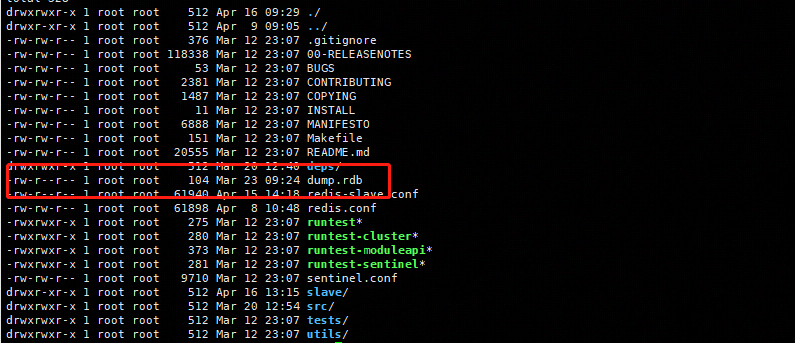

# 持久化

```text

Redis是在内存中存储数据的，当服务重启的时候，所有的数据都将会丢失。在主从实例的数据复制中，
这种数据冗余的方式也是作为数据备份的一种方式。为了保证数据的的安全，Redis还提供了数据持久化
到磁盘中的机制。Redis有两种数据持久化的类型：RDB和AOF。RDB可以看作时Redis在某个时间点上的
快照(snapshot),非常适合于备份和灾难恢复。AOF则是一个写入操作的日志，将在服务器启动时被重放
```

## 使用RDB ##

```text
启用持久化就是防止数据的丢失的最好的方法，实现持久化的一种显而易见的方法时不断地对存储数据进行快照
，而这个基本正是Redis中RDB得工作方式.
```

RDB的操作方式.
```text
1. 调用CONFIG SET命令，在一个正在运行的Redis实例上启用RDB持久化
例子：
192.168.253.1:6379> CONFIG SET save "900 1"
OK

2.如果向永久性的启用RDB，那么我们可以在Redis配置文件上设置save参数：
例子：
root@CHEND-PC:/home/chendom/redis/redis-5.0.8# cat redis.conf |grep "^save"
save 900 1
save 300 10
save 60 10000

3. 要在一个正在运行的redis实例禁用RDB持久化，可以使用redis-cli把save参数设置为空字符串
例子：
192.168.253.1:6379> CONFIG SET save ""
OK

4. 要禁用RDB持久化，只需要在配置文件中注释掉或者删除掉save参数
#save 900 1
#save 300 10
#save 60 10000


5. 通过redis-cli 获取save选项的值可以判断是否启用了RDB功能。如果save选项时一个空字符串，则表示RDB功能时要被禁用的，否则返回RDB快照的
策略：
192.168.253.1:6379> CONFIG GET save
1) "save"
2) "900 1"

6. 我们可以在Redis的数据目录中检查是否生成了RDB 文件
-rw-r--r-- 1 root root    104 Mar 23 09:24 dump.rdb

7. 如果要手动执行RDB快照，在redis-cli中调用SAVE命令即可。redis-cli将会被阻塞一段时间。

8. 或者，我们可以调用BGSAVE 命令来执行非阻塞的RDB转存
例子：
192.168.253.1:6379> BGSAVE
Background saving started

9. 可以使用ps -ef |grep redis 查看转存进程的pid

```


工作原理

```text


RDB就是一台专门给Redis数据存储拍照的照相机。在详细的配置中我们的save配置是这样的：save "900 1" 这个是redis的RDB的触发策略
这个配置的格式就是x1,y1,x2,y2,...其含义就是，如果y个键发生了变化而且此时没有转存正在发生，那么久会在x秒后进行数据转存。“900 1”
就是900秒内如果有一个键发生变化就会进行RDB快照。

通过SAVE或者BGSAVE命令可以手动启动一起RDB转存，这两个转存命令的不同之处在于，前者使用Redis的主线程进行同步转存，而后者则
在后台进行转存。因为SAVE命令会阻塞Redis的服务器，索引永远不要在生产环境中使用。BGSAVE命令在下发之后Redis主线程将继续处理收到的命令，同时会通过fork（）
系统调用一个子线程将转存数据保存到一个名为temp-<bgsave-pid>.rdb的临时文件中。当转存进程结束后，这个临时文件会被重命名为有参数dbfilename定义
的名字并覆盖由参数dir知道的本地目录在的就转存转存文件。删除两个参数可以通过redis-cli进行动态修改。
参数解释
1. # BGSAVE失败时Redis服务器将停止接收写入操作
stop-writes-on-bgsave-error yes
2. # 压缩可以明显的恩介绍转存的文件的大小，但是会在LZF压缩是消耗更多的CPU
rdbcompression yes
3. # 文件尾部创建一个CRC64校验和。使用该选项将在保存和加载快照文件时额外消耗10%性能，将该选项社会为no可以
   # 获得最大的性能，但是也会降低对数据损坏的抵抗能力
   rdbchecksum yes
由于SAVE/BGSAVE命令转存生成的备份文件。我们可以使用操作系统的contab定期将rdb文件复制到本地目录或者Amazon s3/HDFS的远程分布式系统
中，供日后恢复使用.
如果要还原RDB快照，我们需要将快照文件复制到dir选项指定的位置，并且保证启动RedisS实例的用户有该文件的读写权限。之后我们可以通过
SHUTDOWN NOSAVE命令停止实例，并且将住阿奴才能的文件重命名为dbfilename选项知道的文件名字，重新启动之后，数据会从备份文件中加载并且
还原回到Redis服务器中.
```

## 使用AOF ##

```text

1. 调用CONFIG SET命令，在一个正在运行的Redis实例上启用AOF持久化:
192.168.253.1:6379> CONFIG SET appendonly yes
OK

2. 如果要永久的启用AOF持久化，可以在redis.conf配置文件中添加
appendonly no

3. 在运行的redis实例上停止AOF持久化，可以使用CONFIG SET appendonly yes

4. 要永久禁言可以修改redis.conf的appendonly yes


```


工作原理

```text
redis服务器在收到一个实际修改 内存的数据的写入命令的时候，redis会将该命令追缴到AOF文件中。实际上操作系统在写入
AOF文件的写入过程中维护了一个缓冲区，将命令首先写入缓冲区中，而缓冲区的数据必须被书信到磁盘中才能被永久的保存，这个过程通过
调用linux系统的fsync()完成的，这是一个阻塞的调用。只有磁盘设备报告写入完成才会返回。
在将命令追加到AOF文件时，我们可以通过Redis的配置参数appendfysn来调整调用fsync()的频率。该参数有三个选项：
1. appendfsync always:对每个写入的命令调用调用fsync()。这个选项可以确保在发生意外的服务器奔溃或者硬件故障时，值丢失一个命令，但是，
由于fsync()是一个阻塞调用，Redis的性能会收到物理磁盘写入的性能的限制，将appendsysnc设置为always是不明智的，因为Redis服务器的性能
明显的降低.

2. appendfsync everysec 每秒调用一次fsync()。采用这一选项时，在译为灾难时间中只有一秒钟的数据会丢失。我们奖一读者使用此选项一再数据鲁棒性
和性能之间的进行平衡。

3. appendfsync no 永远不调用fsync()。采用该选项时，将由操作系统决定合适将数据从 缓冲区写入到磁盘。再大多数Linux系统中，这个频率
是30s

```


