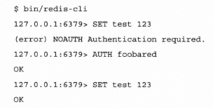

#  生产环境部署

## 在Linux上部署Redis
 ```text
虽然我们可以通过编译源代码的方式在几乎所有现代操作系统上安装Redis，但是运行Redis，Linux是最常见的操作系统。在启动Redis实例之前，通常需要将一些Linu
讷河和操作系统的参数设置为恰当的值，以便在生产环境中发挥最高的性能。
```


### 操作步骤

1. 设置和内存相关的内核参数

```text
sysctl -w vm.overcommit_memory=1
sysctl -w vm.swappiness=0
使用如下的命令来持久化地保存这些参数
echo 1 > /proc/sys/vm/overcommit_memory
echo 0 > /proc/sys/vm/swappiness

----------------------------------------------------------------------------------------------------------------------------------
参数解释:

内核参数overcommit_memory
可选择的值为0,1,2
0：表示内核将检查是否有足够的可用的内存工应用进程使用；如果有足够的可用的内存，内存申请允许;否则内存申请失败，并且把错误返回给应用进程。
1：表示内核允许分配索引的物理内存，而不关当前的内存状态如何。
2：表示内核允许超过的所有物理内存和交换空间总和内存。

什么是overcommit 和OOM
Linux对大部分的申请内存的请求都恢复"yes",以便能跑更多的程序。因为申请内存之后，并不会马上使用内存，这种技术叫做overcommit.当linux
发现内存不足时，会发生OOM Killer(OOM=out of memory).它会选择杀死一些进程(用户态的，不是内核进程)以便释放内存。当oom-killer发生时，linux
会选择杀死哪些进程？选择进程的函数是oom_badness函数(mm/oom_killer.c中)。该函数会计算每个进程的点数(0~1000)。点数越高，这个进程越有可能被
杀死。每个进程的点数都跟oom_score_adj有关，而且oom_score_adj可以被设置(-1000最低，1000最高)。

内核参数swappiness:

该参数的默认值是60，代表党剩余的物理内存低于40%的时候(40=100-60)时，开始使用交换空间.
vm.swappiness=0
最大限度的使用物理内存，然后才是swap空间，即在内存不足的情况下，当剩余内存低于vm.min_free_kbytes_limit时，使用交换空间。
在内存禁止时有限减少RAM里文件系统缓存的大小，而使用swap空间，这是一种提高数据库性能的推荐做法。
vm.swappiness=1
内核3.5及以上，Red Hat内核版本2.6.32-303及以上，进行最少的交换，而不是禁用。
vm.swappiness=10
当系统内存足够时，推荐设置为该值以提高性能。
vm.swappiness=60
默认值
vm.swappines=100
积极的使用交换空间

```


2. 禁用透明大页(transparent huge page)功能：

```text
在 Linux 中大页分为两种： Huge pages ( 标准大页 ) 和  Transparent Huge pages( 透明大页 ) 。
内存是以块即页的方式进行管理的，当前大部分系统默认的页大小为 4096 bytes 即 4K 。 1MB 内存等于 256 页； 1GB 内存等于 256000 页。
CPU 拥有内置的内存管理单元，包含这些页面的列表，每个页面通过页表条目引用。当内存越来越大的时候， CPU 需要管理这些内存页的成本也就越高，这样会对操作系统的性能产生影响。

Huge pages:

Huge pages  是从 Linux Kernel 2.6 后被引入的，目的是通过使用大页内存来取代传统的 4kb 内存页面， 以适应越来越大的系统内存，让操作系统可以支持现代硬件架构的大页面容量功能。
Huge pages  有两种格式大小： 2MB  和  1GB ， 2MB 页块大小适合用于 GB 大小的内存， 1GB 页块大小适合用于 TB 级别的内存； 2MB 是默认的页大小。

Transparent Huge Pages:

Transparent Huge Pages  缩写  THP ，这个是 RHEL 6 开始引入的一个功能，在 Linux6 上透明大页是默认启用的。
由于 Huge pages 很难手动管理，而且通常需要对代码进行重大的更改才能有效的使用，因此 RHEL 6 开始引入了 Transparent Huge Pages （ THP ）， THP 是一个抽象层，能够自动创建、管理和使用传统大页。
THP 为系统管理员和开发人员减少了很多使用传统大页的复杂性 ,  因为 THP 的目标是改进性能 ,  因此其它开发人员  ( 来自社区和红帽 )  已在各种系统、配置、应用程序和负载中对  THP  进行了测试和优化。这样可让  THP  的默认设置改进大多数系统配置性能。但是 ,  不建议对数据库工作负载使用  THP 。
这两者最大的区别在于 :  标准大页管理是预分配的方式，而透明大页管理则是动态分配的方式。
```

```shell script

1. 查看是否使用了透明大页
[root@91f972f07892 vm]# cat /sys/kernel/mm/transparent_hugepage/enabled 
[always] madvise never

2. 关闭的透明大页的方法
 echo never > /sys/kernel/mmtransparent_hugepage/enabled
 开启的是echo always > /sys/kernel/mmtransparent_hugepage/enabled

关闭透明大页的原因：
简单来说就是 Oracle Linux team 在测试的过程中发现，如果 linux 开启透明巨页THP，则 I/O 读写性能降低 30%；如果关闭透明巨页 THP，I/O 读写性能则恢复正常。另，建议在 Oracle Database 中不要使用 THP。


```


3. 对于网络的优化。

```text

sysctl -w net.core.somaxconn=65535
sysctl -w net.ipv4.tcp_max_syn_backlog=65535
持久化可以使用一下的方式
echo "net.core.somaxconn=65535" >> /etc/sysctl.conf
echo "net.ipv4.tcp_max_syn_backlog=65535" >> /etc/sysctl.conf

参数解释：
somaxconn:该内核参数默认值一般是128，对于负载很大的服务程序来说大大的不够。一般会将它修改为2048或者更大。
echo 2048 >   /proc/sys/net/core/somaxconn    但是这样系统重启后保存不了
在/etc/sysctl.conf中添加如下
net.core.somaxconn = 2048然后在终端中执行sysctl -p留个记录

tcp_max_syn_backlog  SYN队列的长度，时常称之为未建立连接队列。系统内核维护着这样的一个队列，用于容纳状态为SYN_RESC的TCP连接(half-open connection),即那些依然尚未得到客户端确认(ack)的TCP连接请求。加大该值，可以容纳更多的等待连接的网络连接数。


```

4. 将进程能够打开的文件数设置为更加高得数值，我们需要先切换到启动Redis进程得用户，然后执行ulimit命令

```shell script
ulimit -n 288000
注意：
我们必须要将nofile设置为一个小于/proc/sys/fs/file-max 的值。因此设置之前我们需要使用cat命令查看/proc/sys/fs/file-max 的值的大小
[sei@cms ipv4]$ ulimit -Hn -Sn
open files                      (-n) 1024
open files                      (-n) 1024
```


### 工作原理

```text

Redis在后台持久化时利用了写时复制(Copy-On-Write,COW)的优点。这意味者在Redis中不需要使用于数据集大小相同的空闲内存。但是。Linux在默认的情况下可能会检查是否
有足够的内存来复制父进程的所以内存项，而这个可能导致OOM(Out of Memory)而奔溃。如果出现这个情况会在运行的日志发现如下的错误:

Redis Error - Can't save in background : fork: Cannot allocate memory

仔细检查发现如下的内容：

WARNING overcommit_memory is set to 0! Background save may fail under low memory condition. 
To fix this issue add 'vm.overcommit_memory = 1' to /etc/sysctl.conf and then reboot or 
run the command 'sysctl vm.overcommit_memory=1'

要解决这个问题就是需要我们将overcommit_memory设置为1，标识当一个程序调用，如malloc()等函数分配内存时，即使系统知道美誉足够的内存空间函数
也会执行成功。第二个内存相关额配置时vm.swappiness，该参数定义了Linux内核将内存中的内容拷贝到交换分区的大小(及频率)。swappiness参数的值越大
，内核在进行内存交换的时候就会越来越激进。


    启用交换内存后，Redis可能会尝试访问磁盘中的内存页。这将导致Redis进程被磁盘I/O操作(可能时一个缓慢的过程)阻塞。我们通常需要充分发挥Redis的处理能力，因此
被交换分区拖慢Redis的速度时不可取的。故而，我们总是建议将vm.swappiness设置为0，值得一提的是，将这个参数设置0对于不同的内核版本来书含义是不同的。
    对于Redis首先应该尽可能避免使用swappiness。此外，在Redis实例没有足够地内存可以使用时，我们希望Redis进程被杀死，也不希望他被交换分区拖慢。如果
Redis服务能够做快速失败(fail-fast)，那么HA或者集群机制就能够妥善处理奔溃地情况。因此，无论Linux内核时什么版本，我们总是建议将这个参数设置为0.


    透明内存大页的功能可能会导致持久化的子进程创建缓慢。因此，我们建议禁用该功能，否则实例在启动的时候就会看到提示：

WARNING you have Transparent Huge Pages (THP) support enabled in your kernel. This will create latency and memory usage issues with Redis. 
To fix this issue run the command 'echo never > /sys/kernel/mm/transparent_hugepage/enabled' as root, and add it to your /etc/rc.local in 
order to retain the setting after a reboot. Redis must be restarted after THP is disabled.
我们可以使用echo never > /sys/kernel/mm/transparent_hugepage/enabled关闭让


    在网络方面的参数，如net.core.somaxconn和net.ipv4.tcp_max_syn_backlog设置为比默认值128大的65535.net.core.somaxconn这个参数设置传递给listen
函数的backlog参数的上限，net.ipv4.tcp_max_syn_backlog设置了挂起连接的最大队列的长度。在Redis中有一个默认值为511的选项tcp-backlog;将这些值设置大一点可以有TCP连接
如果net.core,somaxconn的值设置高于net.ipv4.tcp_max_syn_backlog，那么实例启动时会收到如下的警告：

WARNING: The TCP backlog setting of 511 cannot be enforced because /proc/sys/net/core/somaxconn 
is set to the lower value of 128.


  我们需要设置一个进程能够打开的最大文件数。我们需要确保这个操作系统的值高于Redis的maxclients选项。如果这个参数不满足上述的条件，那么我们的Redis启动之后会收到  
如下的警告：
You requested maxclients of 10000 requiring at least 10032 max file
descriptors. Redis can't set maximum open files to 10032 because of OS
error: Operation not permitted. Current maximum open files is 4096.
maxclients has been reduced to 4064 to compensate for low ulimit. If
you need higher maxclients increase 'ulimit -n'.


```


## Redis的安全配置


```text

1. 修稿配置文件中的bind 和port来更新绑定的IP地址和端口号：
    bind 127.0.0.1 192.168.0.31
    port 36379

2. 不要忘记更新主从复制和Sentinel配置中的相应的参数:
    slaveof 192.168.0.31
    snetinel monitor mymaster 192.168.0.31 36379

3. 我们可以让Redis不监听任何网络接口，而监听Unix域套接字。这样只有拥有套接字的访问权限的本地客户端才可以访问Redis.
    1.我们可以在配置文件中设置unixsocket和unixsocketperm参数，然后将port为0使得Redis只监听unix套接字.
        port 0
        unixsocket /var/run/redis/redis.sock
        unixsocketprm 766
    2. 我们可以使用redis-cli -s <socket>链接到监听在Unix套接字的Redis服务器：
        redis-cli -s /var/run/redis/redis.sock
        redis /var/run/redis/redis.sock>

4. 通过密码验证来保护Redis通常是一个良好的时间。Redis提供了一个分厂简单的验证机制来防止授权的访问。
    1. 需要在redis.conf配置requirepass添加明文秘钥即可
        requirepass 123456
    2.  要访问一个启用了身份验证的redis服务器，需要使用AUTH命令
        
    


```




## 配置客户端连接选项

```text
1. 如果要配置客户端的网络参数，将以下的内容添加到redis.conf即可
    timeout 0
    tcp-backlog 511
2. 如果要配置的Redis实例的最大客户端数量和tcp-keepalive时间，将一下的内容添加到Redis和Sentinel的配置文件即可
    maxclients 10000
    tcp-keepalive 300
3. 如果要配置客户端的缓冲区参数，在Redis.conf配置文件中添加以下的内容即可：
    client-output-buffer-limit normal 0 0 0
    client-output-buffer limit salve 512mb 256mb 60
    client-output-buffer-limit pubsub 32mb 8mb 60

```
工作原理

```text

    我们为Redis实例设置的两个参数都与Redis和客户端之间的网络连接相关。第一个选项是timeiout，表示服务端将在客户端空闲N秒后关闭连接。实际上，指定的timeout会被传递给setsockopt()
来设置SO_SNDTIMEOUT;tcp-bakclog,这个参数设置用于挂起套接字请求队列的大小，在Linux上部署Redis的案例中，我们介绍了内核参数somaxconn.我们应该确保tcp-backlog的值小于somaxconn.
在真实的生产环境中，大多数情况下，我们将其设置为一个高于默认中10000的值。
    maxclients和tcp-keepalive选项对Redis实例和Sentinel都有效。我们强烈建议读者确保为Redis实例以及Sentinel服务设置这两个参数。maxclients选项来限制来自客户端的最大连接数，一旦超过
最大的连接数，客户端将收到来自服务端的错误的提示 ERR max number of clients reached;tcp-keepalive选项，如果将该参数设置为了非零值，那么服务端将按照指定的时间间隔发送TCP ACK来通知网络设备在
此期间的链接仍然获取，如果客户端没有响应TCP活跃的的消息，那么服务器将客户端视为下线并链接关闭。当客户端和Redis服务端之间存在硬件防火将的，这个选项非常有用(避免防火墙在将超时断开之后，服务端和客户端
没有收到通知而无法释放链接)。


```


