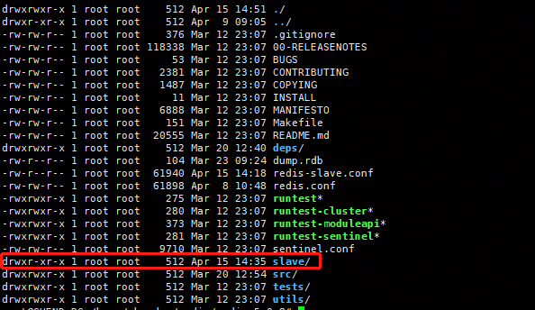
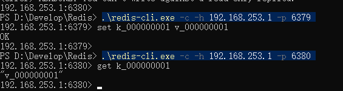
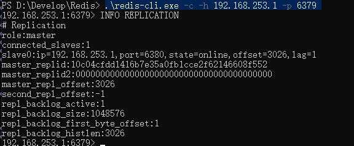

# 复制

```text
Redis提供了了复制机制，保证了单机服务(master，主实例)复制到一个或者多个其他的Redis服务器中(slave)
。这种机制提高了整个系统的容错的能力，还可以用于对系统的进行水平的扩展。在这个重读的应用中，我们可以
通过多个Redis只读从实例来减轻住实例的压力。Redis的复制机制是Redis Cluster的基础，而Redis Cluster在
此基础上提供了高可用性。

```

## 主从复制 ##

```text
因为redis实例只有一个配置文件，我们可以复制redis.conf重命名为redis-clave.conf，然后对复制的配置
文件进行如下的修改

port 6380
pidfile /var/run/redis_6380.pid
dir ./slave
slaveof 192.168.253.1 6379
上面的步骤一定不要忘记创建slave目录
```



从机上写会出现如下的错误


## 主从工作原理 ##

```text
在Redis的复制机制中，共有两种重新同步的机制：部分重新同步和完全重新同步的。当一个Redis的从实例启动并连接到主实例时，
从实例总是会尝试通过发送(master_replid;master_repl_offset)请求进行部分重新同步。其中，(master_replid;master_repl_offset)
表示于主实例同步的最后一个快照。如果主实例接收部分重新同步的请求，那么他会从实例停止时的最后一个偏移处增量的进行命令同步。否则
需要进行完全重新同步。当第一次连接到他的主实例的时候，总是需要进行完全重新同步。在进行其安全重新同步时，为了将所有的数据复制到从
实例中，主实例需要将数据阻转存到RDB文件中，然后将这个文件发送给从实例。从实例接收到的RDB文件之后，会将内存中的所有数据清除，然后
在将RDB文件中的数据导入。主实例上的复制过程时完全同步的，因此不会阻塞服务器处理客户的请求。
```


